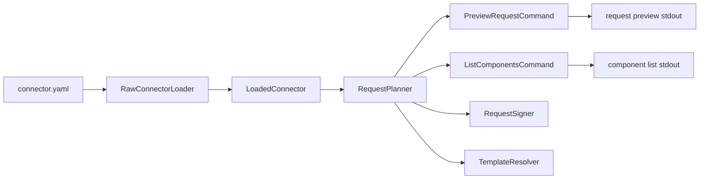

# HDP API Connector 维护者总览

> 这份文档只讲一件事：**如果要扩展 HDP API connector，本仓库该改哪里、按什么顺序改、怎么验收。**

## 先说结论

这个仓库的职责很窄：

- 负责 `connector.yaml` 的 Java 模型、加载、schema 解析、本地静态校验、请求预览、组件清单、signer SPI
- 不负责真实 HTTP 执行、不负责调度、不负责状态管理、不负责重试和运行时编排
- `validator-debugger` 是静态调试入口，不是 runtime

如果你想改的是“connector 怎么长、怎么被读进来、怎么被本地检查、怎么被预览出来”，就看这里。
如果你想改的是“Airbyte manifest 怎么转换成 connector”，那是 `converter` 的事，不是这份文档的主线。

## 仓库边界

### 本仓库负责什么

- `connector-model`：定义并加载 `ApiConnector` 及其下的 `ConnectorSpec`
- `connector-model`：把 `connector.yaml` 里的外部 schema 引用解析成内存中的 JSON 树
- `connector-model`：定义 signer SPI，供 Java signer 实现接入
- `validator-debugger`：做静态校验、请求预览、组件清单输出
- `validator-debugger`：把调试结果以 CLI 形式输出给维护者

### 本仓库不负责什么

- 真实请求发送
- 数据同步编排
- job / task / state 生命周期
- 重试策略
- Airbyte converter 的长期维护叙事

这意味着一个很重要的分界线：

- `connector.yaml` 是静态定义
- `validator-debugger` 只是用它做检查和预览
- 任何“运行时行为”都不应该塞进这里

## 从 `connector.yaml` 到调试输出

当前实现有两条主链路。

### 1. `validate`


链路含义：

- `ConnectorLoader` 负责读 YAML、装配 `ApiConnector`、检查基础结构
- `SchemaResolver` 只处理 `spec.streams[*].schema.ref` 这类外部引用
- `ConnectorValidator` 负责静态规则
- `ValidateCommand` 只负责把诊断打印出来，并把退出码翻译成 CLI 结果

`validate` 的当前输出规则：

- 有错误时，逐条打印 `ERROR <code> <message>`
- 没有错误时打印 `OK`

### 2. `preview-request` 和 `list-components`



这条链路和 `validate` 的关键区别是：

- `preview-request` / `list-components` 使用 `RawConnectorLoader`
- `RawConnectorLoader` 不解析外部 schema 文件
- 所以即使某个 `schema.ref` 文件缺失，`preview-request` 和 `list-components` 也可以继续工作

这是当前实现的有意分工：

- `validate` 关心“定义是否完整、schema 是否真的可读”
- `preview-request` 关心“一个请求最后会长什么样”
- `list-components` 关心“connector 里有哪些可见组件”

## 层职责与扩展入口

### 模型层

相关文件：

- `connector-model/src/main/java/com/hdp/connectorregistry/model/ApiConnector.java`
- `connector-model/src/main/java/com/hdp/connectorregistry/model/ConnectorSpec.java`
- `connector-model/src/main/java/com/hdp/connectorregistry/model/Defaults.java`
- `connector-model/src/main/java/com/hdp/connectorregistry/model/Definitions.java`
- `connector-model/src/main/java/com/hdp/connectorregistry/model/StreamDefinition.java`
- `connector-model/src/main/java/com/hdp/connectorregistry/model/RequestDefinition.java`
- `connector-model/src/main/java/com/hdp/connectorregistry/model/SchemaDefinition.java`
- `connector-model/src/main/java/com/hdp/connectorregistry/model/SignerDefinition.java`
- `connector-model/src/main/java/com/hdp/connectorregistry/model/Metadata.java`

职责：

- 把 `connector.yaml` 的字段映射成 Java record
- 提供后续加载、校验、规划请求时要读的结构

扩展入口：

- 新增字段时，先改模型层，再改加载层 / 校验层 / 规划层
- 只改 YAML 示例、不改模型，不算完成扩展

当前要点：

- `ConnectorSpec` 里已经包含 `connectionSpec`、`defaults`、`definitions`、`signers`、`streams`
- `StreamDefinition` 里已经包含 `name`、`qps`、`request`、`schema`
- `RequestDefinition` 里已经包含 `requesterRef`、`path`、`method`、`signerRef`、`qps`
- `SchemaDefinition` 支持 `ref` 和 `inline`

### 加载层

相关文件：

- `connector-model/src/main/java/com/hdp/connectorregistry/io/ConnectorLoader.java`
- `connector-model/src/main/java/com/hdp/connectorregistry/io/SchemaResolver.java`
- `validator-debugger/src/main/java/com/hdp/connectorregistry/validator/RawConnectorLoader.java`

职责：

- `ConnectorLoader` 读 `connector.yaml`，反序列化成 `ApiConnector`
- `ConnectorLoader` 校验最基本的结构完整性：`spec`、`spec.streams`、非空 stream 项
- `SchemaResolver` 读取 `spec.streams[*].schema.ref` 对应的外部 schema 文件
- `SchemaResolver` 限制 schema 路径必须相对 connector 目录，且不能逃逸到目录外
- `RawConnectorLoader` 只做 YAML 装载，不读外部 schema，供调试 CLI 使用

扩展入口：

- 新增文件路径规则、schema 读取规则、目录越界规则，优先改 `SchemaResolver`
- 新增更早的结构错误，优先改 `ConnectorLoader.validateStructure`
- 如果某个 CLI 不应该强依赖 schema 文件，就继续走 `RawConnectorLoader`

当前行为：

- 绝对 `schema.ref` 会失败
- `../` 这类越界引用会失败
- inline schema 不会走外部文件读取

### 校验层

相关文件：

- `validator-debugger/src/main/java/com/hdp/connectorregistry/validator/ConnectorValidator.java`
- `validator-debugger/src/main/java/com/hdp/connectorregistry/validator/Diagnostic.java`
- `validator-debugger/src/main/java/com/hdp/connectorregistry/validator/DiagnosticSeverity.java`

职责：

- 校验 `connectionSpec` 和用户 config 是否匹配
- 校验外部 schema 引用是否真的被加载到了 `LoadedConnector.schemasByRef`
- 校验 signer 能不能通过 `SignerRegistry` 实例化
- 产出结构化诊断，不负责命令行格式

扩展入口：

- 新增静态规则，优先加在 `ConnectorValidator`
- 新增错误码，优先放到 `Diagnostic.code`
- 新增输出样式，改 CLI，不要把格式化逻辑塞进校验规则里

当前校验实现只覆盖了轻量 JSON Schema 规则：

- `type`
- `required`
- `properties`
- `items`

如果你要加更复杂的 schema 语义，先确认它应该属于校验层还是请求规划层，不要混写。

### 请求规划层

相关文件：

- `validator-debugger/src/main/java/com/hdp/connectorregistry/validator/RequestPlanner.java`
- `validator-debugger/src/main/java/com/hdp/connectorregistry/validator/TemplateResolver.java`
- `validator-debugger/src/main/java/com/hdp/connectorregistry/validator/RequestPreview.java`

职责：

- 计算某个 stream 的最终请求视图
- 做模板解析
- 选择 base URL
- 拼接 path
- 计算 effective QPS
- 在需要时调用 signer，并合并 signer 产出的头、query 参数和 body
- 生成 `list-components` 的组件摘要

扩展入口：

- 改模板语法，改 `TemplateResolver`
- 改请求组成规则，改 `RequestPlanner`
- 改 `preview-request` 的输出字段，改 `RequestPreview` 和 CLI 打印

当前优先级规则：

- `baseUrl`：先看 `definitions.requesters[requesterRef].urlBase`，再看 `spec.defaults.baseUrl`
- `qps`：先看 `request.qps`，再看 `stream.qps`，再看 `spec.defaults.qps`
- `method`：只有在 `RequestDefinition.method` 为 `null` 时才回退到 `GET`；`RequestPlanner.defaultString` 的语义是“值为 `null` 时用 fallback，空字符串会原样保留”
- `path`：先做模板解析，再和 base URL 合成绝对 URL

`TemplateResolver` 当前只解析 `{{ config.<path> }}` 这类表达式。
它支持点号和方括号路径，但不会替你实现完整模板语言。

### Signer SPI 层

相关文件：

- `connector-model/src/main/java/com/hdp/connectorregistry/signer/RequestSigner.java`
- `connector-model/src/main/java/com/hdp/connectorregistry/signer/SignerContext.java`
- `connector-model/src/main/java/com/hdp/connectorregistry/signer/SignerResult.java`
- `connector-model/src/main/java/com/hdp/connectorregistry/signer/SignerRegistry.java`
- `connector-model/src/main/java/com/hdp/connectorregistry/model/SignerDefinition.java`

职责：

- `RequestSigner` 定义签名接口
- `SignerContext` 提供签名所需上下文
- `SignerResult` 返回签名后的头、query 参数和 body
- `SignerRegistry` 用反射按 `className` 实例化 signer

扩展入口：

- 新增 signer 时，只需要新增一个实现 `RequestSigner` 的类
- 只要 class 在 classpath 上，`SignerRegistry` 就可以按类名实例化
- `connector.yaml` 里通过 `spec.signers.<name>.className` 绑定实现

当前约束：

- `type` 缺省时可以省略；一旦显式填写，必须是 `java`
- 如果 `className` 不存在、不能构造、或者不是 `RequestSigner`，`validate` 会报错
- signer 只负责签名，不负责请求规划和 HTTP 执行

### CLI 入口层

相关文件：

- `validator-debugger/src/main/java/com/hdp/connectorregistry/validator/cli/Main.java`
- `validator-debugger/src/main/java/com/hdp/connectorregistry/validator/cli/ValidateCommand.java`
- `validator-debugger/src/main/java/com/hdp/connectorregistry/validator/cli/PreviewRequestCommand.java`
- `validator-debugger/src/main/java/com/hdp/connectorregistry/validator/cli/ListComponentsCommand.java`

职责：

- `Main` 只是 picocli 的入口和子命令注册点
- 各命令只负责参数解析、调用 service、打印结果、返回 exit code

扩展入口：

- 新增命令时，先做 service，再接 CLI
- 新增子命令时，记得把它挂到 `Main`
- 不要在 CLI 里堆业务规则，CLI 只做薄封装

当前命令行为：

- `validate`：加载 connector 和 config，打印诊断；schema 读失败会转成 `SCHEMA_LOAD_FAILED`，其他 connector load 错误仍会直接上抛
- `preview-request`：加载 connector 和 config，打印最终请求视图；加载失败会转成 `CONNECTOR_LOAD_FAILED`
- `list-components`：加载 connector，打印 streams / schemas / signers / definitions

## 常见扩展任务

### 1. 新增一个 `connector.yaml` 字段

先判断这个字段属于哪一层：

- 如果它描述 connector 顶层元数据，优先看 `ApiConnector` / `Metadata`
- 如果它描述整体能力或默认行为，优先看 `ConnectorSpec` / `Defaults` / `Definitions`
- 如果它描述某个 stream，优先看 `StreamDefinition`
- 如果它描述请求细节，优先看 `RequestDefinition`
- 如果它描述 schema，优先看 `SchemaDefinition`
- 如果它描述 signer，优先看 `SignerDefinition`

把字段放进正确的 record 之后，再判断后续影响面：

- 需要被读进来吗，通常会影响 `ConnectorLoader`
- 需要参与静态检查吗，通常会影响 `ConnectorValidator`
- 需要参与请求预览吗，通常会影响 `RequestPlanner` 或 `RequestPreview`
- 需要出现在组件清单里吗，通常会影响 `RequestPlanner.listComponents`

字段说明文档也要跟上，但它不是唯一真相来源：

- `docs/format/connector-schema.md` 负责字段参考入口
- 当前实现仍以模型层、加载层和校验/预览逻辑为准

判断标准很简单：

- 字段只存在于 YAML 示例里，不存在于模型里，扩展就没完成
- 字段进入模型了，但没有被加载/校验/预览使用，也通常还没收尾

### 2. 新增一个 signer

最小步骤：

1. 新建一个实现 `RequestSigner` 的 Java 类
2. 在 `connector.yaml` 的 `spec.signers` 里增加一条定义
3. 在需要使用它的 stream 里填 `request.signerRef`
4. 如果 signer 有额外参数，放到 `SignerDefinition.config`
5. 给 `FixedHeaderSigner` 这类测试 signer 的路径补一个 fixture 或单测

当前实现不需要你改注册表映射：

- `SignerRegistry` 是按 `className` 反射加载的
- 只要 class 名字对、接口实现对、构造器可用，就能接入

如果 signer 是新的类型体系，而不只是新 class，那么还要同步：

- `ConnectorValidator.validateSigners`
- 可能的 `SignerRegistry` 选择逻辑

### 3. 增强 `validate`

最小步骤：

1. 在 `ConnectorValidator` 里加规则
2. 产出新的 `Diagnostic.code`
3. 写或更新 `ConnectorValidatorTest`
4. 如果 CLI 行为变了，再补 `ValidateCommandTest`

建议顺序：

- 先改校验规则
- 再补测试 fixture
- 最后看要不要调整命令行输出文案

不要把规则写进 `ValidateCommand`：

- 命令层只应该负责展示
- 规则本体应该留在 `ConnectorValidator`

### 4. 增强 `preview-request`

最小步骤：

1. 在 `RequestPlanner` 里改请求计算逻辑
2. 如果模板语法变了，改 `TemplateResolver`
3. 如果预览输出字段变了，改 `RequestPreview`
4. 更新 `PreviewRequestCommandTest`
5. 必要时更新 `ListComponentsCommandTest`，因为它共享同一个 planner

关注点按层分：

- 请求如何算，改 `RequestPlanner`
- 字符串如何替换，改 `TemplateResolver`
- 输出怎么看，改 CLI 打印

如果你改了 signer 合并逻辑，记得同时看：

- `RequestPlanner.preview`
- `SignerContext`
- `SignerResult`

## 本地验证与回归检查

本仓库最小的本地检查分两档：

### 全量回归

```bash
./gradlew test
```

### 定向验证

按改动类型挑命令跑：

- 改了组件枚举、组件列表输出或加载边界，就跑 `list-components`
- 改了校验逻辑、错误码或校验提示，就跑 `validate`
- 改了请求规划、模板解析、签名合并或预览输出，就跑 `preview-request`

例如：

```bash
./gradlew :validator-debugger:run --args="list-components --connector connectors/demo-users/connector.yaml"
./gradlew :validator-debugger:run --args="validate --connector connectors/demo-users/connector.yaml --config validator-debugger/src/test/resources/fixtures/config/valid-config.json"
./gradlew :validator-debugger:run --args="preview-request --connector connectors/demo-users/connector.yaml --stream users --config validator-debugger/src/test/resources/fixtures/config/preview-config.json"
```

如果你在改字段模型，回归清单至少还要包含：

- `docs/format/connector-schema.md`
- 相关 fixture
- 相关单测

## 与其他文档的关系

这三份文档不要互相打架：

- `README.md`：项目入口、模块概览、快速开始
- `docs/format/connector-schema.md`：`connector.yaml` 的字段参考
- `docs/architecture.md`：维护者扩展视角，回答“该改哪里、怎么扩、怎么验”

阅读顺序建议是：

1. 先看 `README.md`，确认模块和运行方式
2. 再看 `docs/architecture.md`，建立扩展路径心智模型
3. 最后看 `docs/format/connector-schema.md`，查具体字段

如果你正在改的是一个对外可见的结构字段，最终还是要回到字段参考；如果你正在改的是层次边界或扩展入口，这份架构文档才是主文档。
