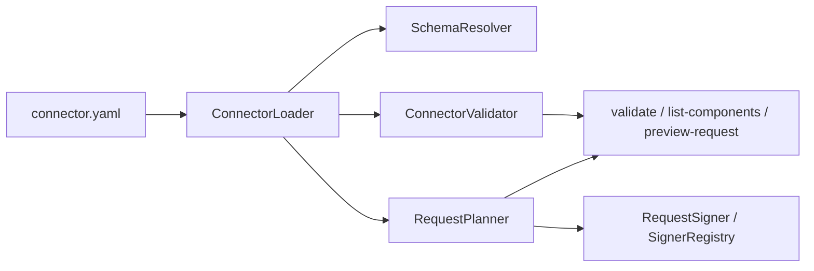

# HDP API Connector 维护者文档 Implementation Plan

> **For agentic workers:** REQUIRED SUB-SKILL: Use superpowers:subagent-driven-development (recommended) or superpowers:executing-plans to implement this plan task-by-task. Steps use checkbox (`- [ ]`) syntax for tracking.

**Goal:** 新增一份面向内部维护者的 `docs/architecture.md`，讲清 HDP API connector 的扩展链路，并在 `README.md` 中补上对应入口。

**Architecture:** 这次是文档实现，不改运行时代码。主文档落在 `docs/architecture.md`，它负责解释仓库边界、处理链路、扩展入口和常见扩展任务；`README.md` 继续只做项目入口和文档导航，不承担维护者手册职责。

**Tech Stack:** Markdown、现有 Java 源码、现有格式文档与 CLI 命令

---

## Planned File Structure

- `docs/architecture.md`
  - 新增的维护者总览文档，主线是“如何扩展 HDP API connector”。
- `README.md`
  - 只补文档导航和一句维护者入口说明，不继续膨胀成完整手册。
- `docs/format/connector-schema.md`
  - 作为字段字典被引用；如果当前工作区已经有经过确认的本地字段文档改动，执行时一并纳入文档提交，避免收尾时留下脏工作区。

## Task 1: Draft the Maintainer Architecture Guide

**Files:**
- Create: `docs/architecture.md`
- Reference: `docs/format/connector-schema.md`
- Reference: `connector-model/src/main/java/com/hdp/connectorregistry/io/ConnectorLoader.java`
- Reference: `connector-model/src/main/java/com/hdp/connectorregistry/io/SchemaResolver.java`
- Reference: `connector-model/src/main/java/com/hdp/connectorregistry/signer/RequestSigner.java`
- Reference: `connector-model/src/main/java/com/hdp/connectorregistry/signer/SignerRegistry.java`
- Reference: `validator-debugger/src/main/java/com/hdp/connectorregistry/validator/ConnectorValidator.java`
- Reference: `validator-debugger/src/main/java/com/hdp/connectorregistry/validator/RequestPlanner.java`
- Reference: `validator-debugger/src/main/java/com/hdp/connectorregistry/validator/TemplateResolver.java`
- Reference: `validator-debugger/src/main/java/com/hdp/connectorregistry/validator/cli/ValidateCommand.java`
- Reference: `validator-debugger/src/main/java/com/hdp/connectorregistry/validator/cli/PreviewRequestCommand.java`
- Reference: `validator-debugger/src/main/java/com/hdp/connectorregistry/validator/cli/ListComponentsCommand.java`

- [ ] **Step 1: 写文档开头和仓库边界**

在 `docs/architecture.md` 中先写标题、适用读者、仓库负责 / 不负责的边界，正文以“维护者如何扩展 HDP API connector”为中心，不提 Airbyte converter。

```md
# HDP API Connector Architecture

本文档面向仓库内部维护者，回答“如果我要扩展 HDP API connector，我应该改哪里、怎么验证、边界是什么”。

## 仓库边界

本仓库负责：

- `connector.yaml` 规范与 Java 模型
- schema 引用解析
- 本地静态校验
- 请求预览
- signer SPI

本仓库不负责：

- 真实 HTTP 执行
- 调度任务
- 增量状态与 checkpoint
- 重试与运行时编排
```

- [ ] **Step 2: 写从 YAML 到调试输出的处理链路**

用一节文字加一个简洁的 Mermaid 图，把 `connector.yaml -> ConnectorLoader -> SchemaResolver -> ConnectorValidator / RequestPlanner -> Signer -> CLI` 串起来，并明确每层输入、输出、职责和非职责。

~~~~md
## 从 YAML 到调试输出的处理链路



- `ConnectorLoader` 负责把 YAML 装成 `LoadedConnector`
- `SchemaResolver` 负责解析 `schema.ref`
- `ConnectorValidator` 负责静态规则检查
- `RequestPlanner` 负责模板解析、base URL 选择、QPS 继承和 signer 合并
- CLI 层只负责把前面的能力暴露成命令
~~~~

- [ ] **Step 3: 写模块职责与扩展入口**

按“模型层、加载层、校验层、请求规划层、Signer SPI 层、CLI 入口层”分节，每节都要给出代码路径和一句扩展结论。

```md
## 模块职责与扩展入口

### 模型层

入口：

- `connector-model/.../ApiConnector.java`
- `connector-model/.../ConnectorSpec.java`
- `connector-model/.../StreamDefinition.java`
- `connector-model/.../RequestDefinition.java`

扩展原则：

- 新字段通常先从模型层进入
- 只改 YAML 示例、不改模型，不算完成扩展

### 校验层

入口：

- `validator-debugger/.../ConnectorValidator.java`
- `validator-debugger/.../Diagnostic.java`

扩展原则：

- 静态规则优先集中在 `ConnectorValidator`
- 不要把规则散落到 CLI command
```

- [ ] **Step 4: 写常见扩展任务手册**

至少覆盖四类任务：新增字段、新增 signer、增强 `validate`、增强 `preview-request`。每类都用“改哪些类 / 需要同步什么文档 / 最少跑什么命令”的格式。

```md
## 常见扩展任务

### 新增一个 `connector.yaml` 字段

1. 修改 `connector-model` 中对应模型
2. 如果字段影响文件解析，修改 `ConnectorLoader` 或 `SchemaResolver`
3. 如果字段需要静态检查，修改 `ConnectorValidator`
4. 如果字段影响最终请求，修改 `RequestPlanner`
5. 同步 `docs/format/connector-schema.md`
6. 补测试并运行 `./gradlew test`

### 新增一个 signer

1. 新建实现 `RequestSigner` 的类
2. 通过 `SignerContext` 读取 method、URI、config 和 signerConfig
3. 返回 `SignerResult`
4. 用 `validate` 检查类可装载
5. 用 `preview-request` 检查签名结果是否合并正确
```

- [ ] **Step 5: 写本地验证和相关文档入口**

文档尾部加入维护者最小验证命令和与其他文档的边界说明。

~~~~md
## 本地验证与回归检查

```bash
./gradlew test
./gradlew :validator-debugger:run --args="list-components --connector connectors/demo-users/connector.yaml"
./gradlew :validator-debugger:run --args="validate --connector connectors/demo-users/connector.yaml --config validator-debugger/src/test/resources/fixtures/config/valid-config.json"
./gradlew :validator-debugger:run --args="preview-request --connector connectors/demo-users/connector.yaml --stream users --config validator-debugger/src/test/resources/fixtures/config/preview-config.json"
```

## 与其他文档的关系

- `README.md`：项目入口
- `docs/format/connector-schema.md`：字段字典
- `docs/architecture.md`：维护者扩展总览
~~~~

- [ ] **Step 6: 本地预览文档成品**

Run: `sed -n '1,260p' docs/architecture.md`

Expected:

```text
# HDP API Connector Architecture
...
## 仓库边界
...
## 从 YAML 到调试输出的处理链路
...
## 常见扩展任务
```

- [ ] **Step 7: Commit**

```bash
git add docs/architecture.md
git commit -m "docs: add maintainer architecture guide"
```

## Task 2: Update README Navigation Without Turning It Into a Manual

**Files:**
- Modify: `README.md`
- Reference: `docs/architecture.md`
- Carry-forward if already approved locally: `docs/format/connector-schema.md`

- [ ] **Step 1: 在文档导航里加入维护者入口**

保持现有 README 结构，只在“文档导航”中新增一条架构文档入口，并加一句简短说明；如果 `README.md` 已经带有本地未提交的项目说明增强内容，直接在那一版上合并，不要回退。

```md
## 文档导航

- 项目格式总览和 Airbyte 映射：`docs/format/airbyte-mapping.md`
- `connector.yaml` 逐字段说明：`docs/format/connector-schema.md`
- 维护者扩展总览：`docs/architecture.md`
- 设计 spec 中文版：`docs/superpowers/specs/2026-04-22-airbyte-compatible-connector-registry-design.zh-CN.md`
- 当前 MVP 实现计划：`docs/superpowers/plans/2026-04-22-hdp-connector-registry-mvp.md`
```

- [ ] **Step 2: 校对 README 片段，确保没有把 README 膨胀成维护手册**

Run: `sed -n '100,130p' README.md`

Expected:

```text
## 文档导航
- ... connector-schema.md
- ... docs/architecture.md
```

- [ ] **Step 3: Commit**

```bash
git add README.md docs/format/connector-schema.md
git commit -m "docs: refresh project docs and maintainer navigation"
```

## Task 3: Verify the Documentation Against the Current Repo

**Files:**
- Verify: `docs/architecture.md`
- Verify: `README.md`
- Verify: `docs/format/connector-schema.md`

- [ ] **Step 1: 跑 Markdown / diff 基础检查**

Run: `git diff --check`

Expected:

```text
(no output)
```

- [ ] **Step 2: 复跑仓库基础测试，确认文档命令没有写错**

Run: `./gradlew test`

Expected:

```text
BUILD SUCCESSFUL
```

- [ ] **Step 3: 检查最终工作区状态**

Run: `git status --short --branch`

Expected:

```text
## main
```

如果这里仍有未提交的文档修正，先检查差异，再执行：

```bash
git add README.md docs/architecture.md docs/format/connector-schema.md
git commit -m "docs: align maintainer guide with verification results"
```
